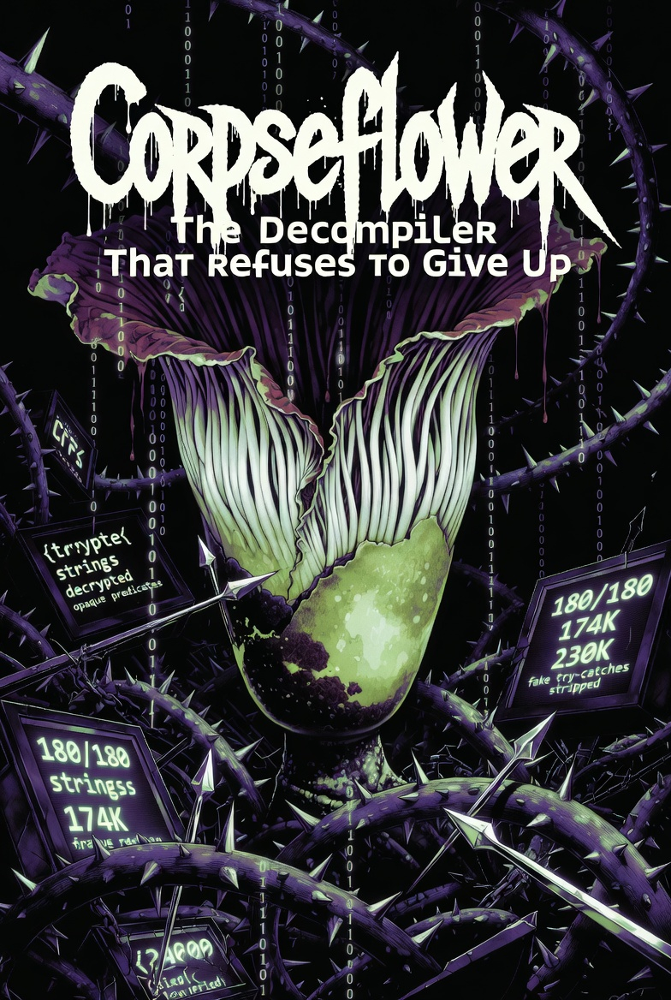

<div align="center">



<br><br>

[](https://openjdk.org/)
[](https://vineflower.org/)
[](LICENSE.md)
[](https://github.com/leibnitz27/cfr)

<br>

*A weaponized [Vineflower](https://github.com/Vineflower/vineflower) fork for reverse engineering obfuscated Java.*
*Integrates bytecode deobfuscation, multi-strategy control flow recovery,*
*and embedded quality benchmarking — all in a single JAR.*

*Named after [Amorphophallus titanum](https://en.wikipedia.org/wiki/Amorphophallus_titanum) — the corpse flower.*
*Beautiful on the inside. Overwhelming if you get too close.*

</div>

<br>

## Why Corpseflower

> Most decompilers emit a stub and move on when they hit obfuscated bytecode.
> **Corpseflower doesn't.**

<table>
<tr>
<td width="25%"><strong>Feature</strong></td>
<td width="25%" align="center"><strong>Vineflower</strong></td>
<td width="25%" align="center"><strong>CFR</strong></td>
<td width="25%" align="center"><strong>Corpseflower</strong></td>
</tr>
<tr><td>Modern Java (21+)</td><td align="center">✅</td><td align="center">❌ stuck at ~14</td><td align="center">✅</td></tr>
<tr><td>ZKM deobfuscation</td><td align="center">❌</td><td align="center">⚠️ partial</td><td align="center"><strong>✅ integrated</strong></td></tr>
<tr><td>String decryption</td><td align="center">❌</td><td align="center">❌</td><td align="center"><strong>180/180</strong></td></tr>
<tr><td>Opaque predicate removal</td><td align="center">❌</td><td align="center">❌</td><td align="center"><strong>174K</strong></td></tr>
<tr><td>Fake try-catch removal</td><td align="center">❌</td><td align="center">❌</td><td align="center"><strong>230K</strong></td></tr>
<tr><td>Exception table repair</td><td align="center">❌</td><td align="center">❌</td><td align="center"><strong>ASM verified</strong></td></tr>
<tr><td>Irreducible flow recovery</td><td align="center">5 splits then stub</td><td align="center">garbage loops</td><td align="center"><strong>arrow-set dispatchers</strong></td></tr>
<tr><td>Quality benchmarking</td><td align="center">—</td><td align="center">—</td><td align="center"><strong>embedded CFR gate</strong></td></tr>
<tr><td>Actively maintained</td><td align="center">✅</td><td align="center">❌ since 2021</td><td align="center"><strong>✅</strong></td></tr>
</table>

<br>

## Quick Start

```bash
# Clone & build
git clone https://github.com/J3Techs/corpseflower.git && cd corpseflower
./gradlew shadowJar

# Decompile — auto-detects and handles obfuscation
java -jar build/libs/corpseflower.jar input.jar output_dir/

# Batch mode with progress
java -jar build/libs/corpseflower.jar --verbose jar_directory/ output_dir/
```

> **Requires** Java 17+ to build, 21 recommended.
> Best performance on [Amazon Corretto 21](https://aws.amazon.com/corretto/) or [JetBrains Runtime 21](https://github.com/JetBrains/JetBrainsRuntime).

<br>

---

<br>

## How It Works

Corpseflower runs three stages on every input. No temp files. No shell scripts. No manual intervention.

<br>

<table>
<tr>
<td width="33%" valign="top">

### ① Deobfuscation

> `PRE_DECOMPILE` hook — in-memory, zero I/O

- **String decryption** via classloader reflection
- **18 opaque predicate sub-passes** — constant folding, algebraic identity, cross-block propagation
- **230K+ fake try-catch** handlers stripped
- **Exception table repair** via ASM BasicVerifier
- **ZKM infrastructure** purged — 138 classes, 1K methods, 1K fields
- **Encrypted classes** safely isolated

</td>
<td width="33%" valign="top">

### ② Decompilation

> Enhanced Vineflower engine

- **24x irreducible split budget** (up from 5)
- **Statement destination recovery** — no more "nodes not found" crashes
- **CFG-level exception cleanup** — non-throwing edges, redundant close blocks
- **Built-in AST passes:**
  - `ConstantExpressionFolder`
  - `DeadCodeEliminator`
  - `StateMachineDeflattener`

</td>
<td width="33%" valign="top">

### ③ Quality Gate

> Embedded CFR 0.152 benchmark

- Same bytecode → CFR in parallel
- **Per-method** quality scoring
- **Per-member** source splicing
- Clean output → Corpseflower wins
- `$VF` stub → CFR spliced in
- Goal: **zero CFR selections**

</td>
</tr>
</table>

<br>

---

<br>

## Multi-Strategy Control Flow Recovery

> *Corpseflower's signature capability.*
> When standard decompilation fails on irreducible control flow,
> it doesn't give up — it escalates.

```
  ┌─────────────────────────────────────────────────────────┐
  │  STRATEGY 1 ─ Vineflower DomHelper                     │
  │  CFG → dominator tree → structured statements           │
  │  Handles 95%+ of all methods                            │
  └──────────────┬──────────────────────────────────────────┘
                 │ fails
  ┌──────────────▼──────────────────────────────────────────┐
  │  STRATEGY 2 ─ Purplesyringa Dispatchers                 │
  │  Detect irreducible regions (SCC + dominator analysis)  │
  │  Insert synthetic switch(__dispatch) blocks              │
  │  Re-run DomHelper on now-reducible CFG                  │
  └──────────────┬──────────────────────────────────────────┘
                 │ fails
  ┌──────────────▼──────────────────────────────────────────┐
  │  STRATEGY 3 ─ Arrow-Set Direct Construction             │
  │  Build statement tree from linearized bytecode           │
  │  Recursive split-gap partitioning                        │
  │  Bypasses DomHelper entirely                             │
  └──────────────┬──────────────────────────────────────────┘
                 │ fails (shouldn't)
  ┌──────────────▼──────────────────────────────────────────┐
  │  STRATEGY 4 ─ CFR Quality Gate                          │
  │  Embedded CFR decompiles same bytecode                   │
  │  Any method CFR wins = Corpseflower bug to fix           │
  └─────────────────────────────────────────────────────────┘
```

Arrow-set recovery is based on [purplesyringa's research](https://purplesyringa.moe/blog/recovering-control-flow-structures-without-cfgs/) on recovering control flow structures without CFGs. Corpseflower is the first decompiler to integrate this technique.

<br>

---

<br>

## Results

> Validated against **452 production Java bundles** — 30 ZKM-obfuscated, 422 clean.

<table>
<tr>
<td width="50%">

| Metric | Before | After |
|:---|:---:|:---:|
| Tools required | 3 + script | **1 JAR** |
| Encrypted strings recovered | 0 | **180 / 180** |
| Opaque predicates | 174K present | **174K removed** |
| Fake try-catch blocks | 230K present | **230K removed** |
| Decompiler stubs (hardest JAR) | 22 | **2** |
| CFR "Exception decompiling" | 42 | **0** |
| Total failures | Many | **0** |

</td>
<td width="50%">

```
Deobfuscation
━━━━━━━━━━━━━━━━━━━━━━━━━━ 100%
Strings:     ████████████████████  180/180
Predicates:  ████████████████████  174K
Try-catch:   ████████████████████  230K
Exn verify:  ████████████████████  120+

Decompilation
━━━━━━━━━━━━━━━━━━━━━━━━━━
Source files: ████████████████████  15,272
Failures:    ▏                     0
Stubs:       ▏                     2
```

</td>
</tr>
</table>

<br>

---

<br>

<details>
<summary><h2>📋 CLI Reference</h2></summary>

<br>

```
java -jar corpseflower.jar [options] <source> <destination>
```

| Option | Description |
|:---|:---|
| `--verbose` | Detailed progress — deobfuscation stats, quality gate decisions |
| `--no-deobfuscate` | Skip ZKM deobfuscation stage |
| `--no-quality-gate` | Skip CFR comparison (faster) |
| `--threads N` | Decompilation thread count (default: CPU count) |

`<source>` — JAR, class file, or directory of JARs.
`<destination>` — output directory for Java source.

All standard Vineflower options are also accepted (e.g., `-dgs=1`, `-hdc=0`).

</details>

<details>
<summary><h2>🏗️ Architecture</h2></summary>

<br>

```
corpseflower.jar
│
├─ org.corpseflower
│  ├─ CorpseflowerMain ─────────────── CLI entry point
│  ├─ CorpseflowerRunner ───────────── Pipeline orchestrator
│  │
│  ├─ deobfuscation/ ───────────────── STAGE 1
│  │  ├─ LegacyFdrsDeobfuscator        4,300 lines — full deobfuscator port
│  │  ├─ CorpseflowerPreDecompilePass   PRE_DECOMPILE hook
│  │  ├─ DeobfuscationStage            Detection + invocation
│  │  └─ PreDecompileContext            Vineflower bridge
│  │
│  ├─ irreducible/ ─────────────────── PURPLESYRINGA
│  │  ├─ ArrowSet                       Arrow-set data structure
│  │  ├─ IrreducibleRegionFinder        SCC + dominator + collision
│  │  ├─ DispatcherBlockBuilder         Synthetic switch insertion
│  │  ├─ IrreducibleDispatcherInserter  Orchestrator
│  │  └─ ArrowSetStatementBuilder       Direct statement construction
│  │
│  ├─ passes/ ──────────────────────── STAGE 2 (AST)
│  │  ├─ ConstantExpressionFolder       Arithmetic + algebraic identity
│  │  ├─ DeadCodeEliminator             Dead if/switch/while removal
│  │  └─ StateMachineDeflattener        ZKM state machine linearization
│  │
│  └─ quality/ ─────────────────────── STAGE 3
│     ├─ CfrBridge                      CFR API invocation
│     ├─ QualityScorer                  Per-method scoring
│     └─ OutputMerger                   Per-member source splicing
│
├─ org.jetbrains.java.decompiler ───── VINEFLOWER CORE (modified)
│  ├─ api/java/JavaPassLocation         + PRE_DECOMPILE enum
│  ├─ struct/StructContext              In-memory class replacement
│  ├─ struct/consts/ConstantPool        Encrypted class tolerance
│  └─ modules/decompiler/              Enhanced decomposition
│
└─ lib/cfr-0.152.jar ──────────────── EMBEDDED CFR (MIT)
```

</details>

<details>
<summary><h2>🧬 Lineage</h2></summary>

<br>

```
Fernflower ──────────────────── JetBrains, 2014
  └── ForgeFlower ───────────── MinecraftForge
        └── Quiltflower ─────── FabricMC / QuiltMC
              └── Vineflower ── vineflower.org, 2024
                    │
                    └── CORPSEFLOWER ── J3Techs, 2026
                          │
                          ├── + FDRSDeobfuscator v2.9
                          ├── + Purplesyringa arrow-set recovery
                          └── + Embedded CFR 0.152 quality gate
```

</details>

<details>
<summary><h2>⚙️ Stage 1 Deep Dive — Deobfuscation Passes</h2></summary>

<br>

The deobfuscator runs an 8-round convergence loop with 20+ passes per round:

**Phase 0 — Detection**
- ZKM package structure identification
- Per-class opaque predicate scanning
- Encrypted class isolation (non-CAFEBABE → `.class.encrypted`)

**Phase 1 — String Decryption**
- URLClassLoader from input JAR → load ZKM decryptor classes
- Synthetic class building for per-class opaque predicate resolution
- `<clinit>` simulation fallback for unreflectable classes
- **Result: 180/180 strings (100%)**

**Phase 2 — Flow Cleanup** *(8-round convergence)*

| Pass | What it does |
|:---|:---|
| `removeFakeTryCatch` | 4 patterns: ATHROW, degenerate, POP, ASTORE+GOTO |
| `removeDeadCode` | Linear post-terminator elimination |
| `shortenGotoChains` | Chain shortcutting + redundant GOTO removal |
| `reorderBasicBlocks` | Greedy block linearization |
| `localizeRegisterFields` | Move opaque fields → local variables |
| `eliminateUnreachableCode` | BFS reachability analysis |
| `simplifyOpaquePredicates` | **18 sub-passes** (A, E0, E, E2, E_CHAIN, E_ALG, E_ALG2, E3, B, C, D, F, G, GOTO_DEAD) |
| `removeDeadExpressions` | Constant chains → POP |
| `consolidateExceptionTable` | Merge same-handler entries |
| `cleanupExceptionHandlers` | Non-throwing / dead / duplicate removal |
| `verifyAndFixExceptionTable` | ASM BasicVerifier → iterative entry removal |

**Phase 3 — Infrastructure Removal**
- Delete ZKM package (138 classes)
- Strip opaque methods (1,076) and fields (1,086)
- Clean obfuscated variable names

</details>

<details>
<summary><h2>📊 JDK Performance Benchmarks</h2></summary>

<br>

Tested on 12 JARs (6 obfuscated + 6 clean), full pipeline:

| Rank | JDK | Time | vs Baseline |
|:---:|:---|:---:|:---:|
| 🥇 | JetBrains Runtime 21 | 52.9s | -3.3% |
| 🥈 | Amazon Corretto 21 | 53.7s | -1.9% |
| 🥉 | Azul Zulu 21 | 53.9s | -1.5% |
| 4 | Eclipse Temurin 21 | 54.7s | baseline |
| 5 | Microsoft OpenJDK 21 | 55.5s | +1.4% |
| 6 | Oracle GraalVM 21 | 62.1s | +13.5% |

Zero quality differences across JDKs. GraalVM's JIT warmup cost hurts batch workloads.

</details>

<br>

---

<br>

## License

**Apache 2.0** — same as Vineflower. CFR 0.152 embedded under MIT. See [`lib/`](lib/).

<br>

## Acknowledgments

<table>
<tr>
<td align="center" width="25%"><a href="https://vineflower.org/"><strong>Vineflower</strong></a><br><sub>The foundation.<br>Clean, fast, well-architected.</sub></td>
<td align="center" width="25%"><a href="https://github.com/leibnitz27/cfr"><strong>CFR</strong></a><br><sub>The quality benchmark.<br>Permissive where others are strict.</sub></td>
<td align="center" width="25%"><a href="https://purplesyringa.moe/blog/recovering-control-flow-structures-without-cfgs/"><strong>purplesyringa</strong></a><br><sub>Arrow-set recovery.<br>Handles what neither can.</sub></td>
<td align="center" width="25%"><a href="https://asm.ow2.io/"><strong>ASM 9.7.1</strong></a><br><sub>Bytecode analysis.<br>The bedrock under everything.</sub></td>
</tr>
</table>

<br>

<div align="center">

---

*Built for the code that fights back.*

</div>
